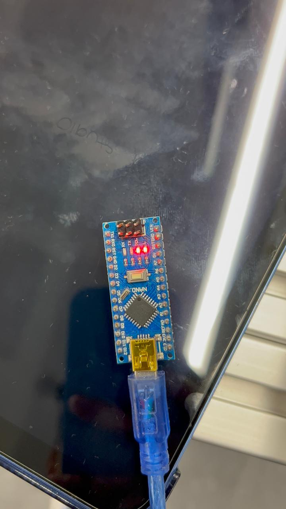

# Práctica 1: Sistemas Embebidos

En esta parte, programamos diferentes microcontroladores con el objetivo de aprender a utilizarlos, conocer sus distintas interfaces de programación y desarrollar un programa sencillo para hacer parpadear el *LED integrado* de cada uno:

## 1) ESP32 DevKit V1

### 1.1 Imagen del micro utilizado
En este apartado se muestra una fotografía del *ESP32 DevKit V1* que se utilizó, para identificar claramente el modelo y sus componentes principales (pines, puerto, etc.).


*Figura 1:* ESP32 DevKit V1.

### 1.2 Imagen de la configuración del intérprete
Aquí se incluye una captura de pantalla de la configuración del entorno/intérprete utilizado (en este caso, **Thonny**), mostrando parámetros clave como el modelo de la placa, el puerto COM y la versión del intérprete.


*Figura 2:* Thonny Micropyhton.

### 1.3 Video
<video controls width="720">
  <source src="{{ '/assets/videos/vESP32.mp4' | relative_url }}" type="video/mp4">
  Tu navegador no soporta video HTML5.
</video>

### 1.4 Programa
A continuación se muestra el *código utilizado* para hacer parpadear el LED integrado. Este programa permite verificar que la placa fue detectada correctamente y que la carga/ejecución funciona como se espera.


````md
```Mirco python
# blink_esp32_devkitv1.py
from machine import Pin
import time

LED = Pin(2, Pin.OUT)

while True:
    LED.value(1)
    time.sleep(0.5)
    LED.value(0)
    time.sleep(0.5)
```
````

## 2) Arduino UNO

### 2.1 Imagen del micro utilizado
En este apartado se muestra una fotografía del *Arduino UNO* que se utilizó, para identificar claramente el modelo y sus componentes principales (pines, puerto, etc.).


*Figura 3:* Arduino UNO.

### 2.2 Imagen de la configuración del intérprete
Aquí se incluye una captura de pantalla de la configuración del intérprete utilizado (en este caso, **La IDE de arduino**), mostrando parámetros clave como el modelo de la placa y el puerto COM.


*Figura 4:* Arduino IDE.

### 2.3 Video
<video controls width="720">
  <source src="{{ '/assets/videos/vArduinoUNO.mp4' | relative_url }}" type="video/mp4">
  Tu navegador no soporta video HTML5.
</video>

### 2.4 Programa
A continuación se muestra el *código utilizado* para hacer parpadear el LED integrado en el arduino. Este programa permite verificar que la placa fue detectada correctamente y que la carga funciona como se espera.

````md
```Arduino
// blink_uno_nano.ino
void setup() {
  pinMode(LED_BUILTIN, OUTPUT);
}

void loop() {
  digitalWrite(LED_BUILTIN, HIGH);
  delay(500);
  digitalWrite(LED_BUILTIN, LOW);
  delay(500);
}
```
````

## 3) Arduino Nano

### 3.1 Imagen del microcontrolador utilizado

En esta sección se presenta una fotografía del **Arduino Nano** empleado durante la práctica, con el objetivo de identificar claramente la tarjeta utilizada y sus principales componentes físicos.



*Figura 3: Tarjeta Arduino Nano utilizada en la programación.*

---

### 3.2 Imagen de la configuración en la IDE de Arduino

A continuación se muestra una captura de pantalla de la **IDE de Arduino**, donde se observa la selección del modelo de placa correspondiente al **Arduino Nano** y el puerto de comunicación.


*Figura 4: Configuración de placa y puerto para Arduino Nano.*

---

### 3.3 Video de funcionamiento

En el siguiente enlace se puede visualizar el video del funcionamiento del Arduino Nano, donde se observa el parpadeo del LED integrado:

<video controls width="720">
  <source src="{{ '/assets/videos/ArduinoNano.mp4' | relative_url }}" type="video/mp4">
  Tu navegador no soporta video HTML5.
</video>


### 3.4 Programa utilizado

```arduino
// blink_nano.ino
void setup() {
  pinMode(LED_BUILTIN, OUTPUT);
}

void loop() {
  digitalWrite(LED_BUILTIN, HIGH);
  delay(500);
  digitalWrite(LED_BUILTIN, LOW);
  delay(500);
}
```
